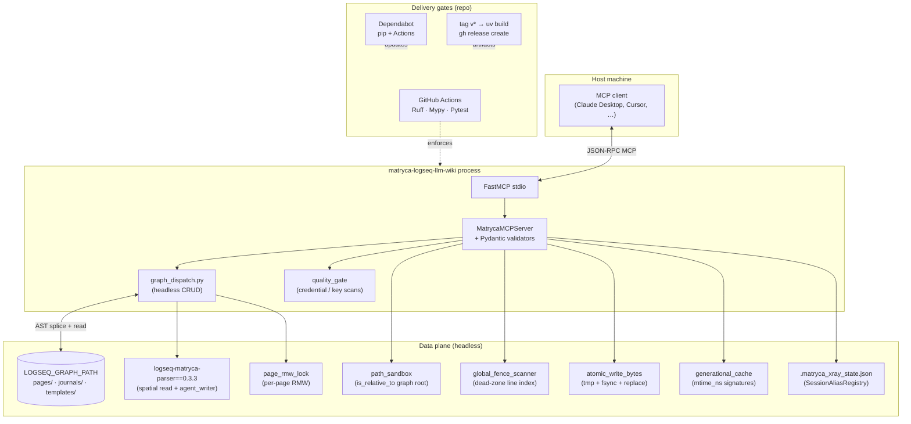
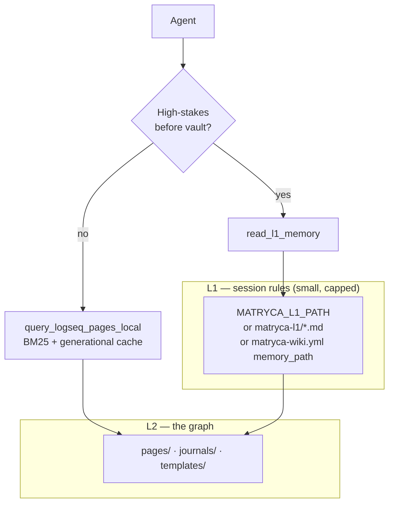
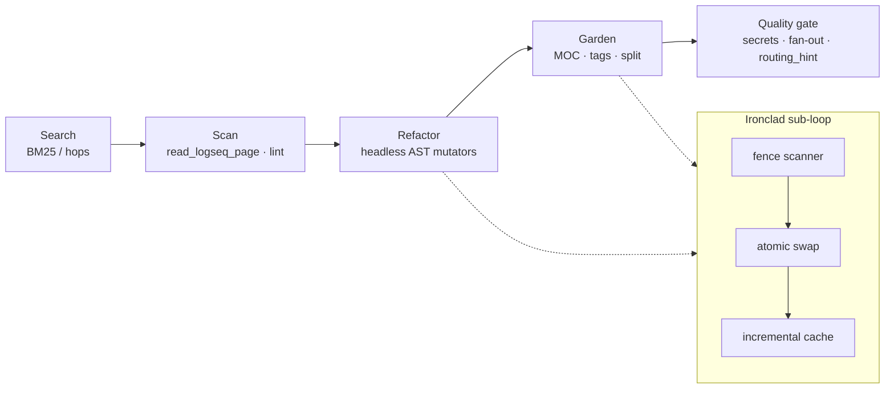

# Matryca Logseq LLM Wiki (v1.4.0 — Headless Edition)

> Agentic Knowledge Management for Logseq OG. An MCP server that turns your favorite AI into a spatial Knowledge Architect. It treats your vault as a tree of blocks, not a flat document store. Local-first, database-free, and Markdown-purist.

[](https://github.com/MarcoPorcellato/matryca-logseq-llm-wiki/actions/workflows/ci.yml)
[](https://github.com/MarcoPorcellato/matryca-logseq-llm-wiki/actions/workflows/ci.yml)
[](https://www.python.org/downloads/)
[](LICENSE)


Matryca is a **100% Headless, sandboxed** MCP server and CLI built to turn your local Logseq graph into a high token-density agentic workspace — **with no network APIs and no background desktop app required**.

The shift from a **stateful, network-bounded** architecture (Logseq Electron + JSON-RPC) to a **local-first, zero-dependency** model is the milestone of **v1.4.0 — The Headless Revolution**: one required variable (`LOGSEQ_GRAPH_PATH`), atomic AST writes via `logseq-matryca-parser==0.3.3`, and X-Ray persistence in `.matryca_xray_state.json`.

---

## ✨ Core Features

* 🌌 **AST Spatial Intelligence:** understands Logseq’s native parent-child block structure via a deterministic parser.
* 🤖 **100% Headless & Local-First:** does not require the Logseq desktop app to be open. Mutations use atomic file I/O directly on `.md` sources.
* 🩻 **X-Ray Token Economy (Printing Press Mode):** compresses Markdown trees and maps UUIDs to persistent aliases like `[0]`, `[1]` — up to ~35× less context noise.
* 🔒 **Sandboxed Privacy:** mathematically blocks path-traversal attempts outside the graph root (`path_sandbox.py`).
* ⚡ **Agent-Native CLI:** fast, minimal `matryca` command optimized for terminal scripts and local LLMs (including `matryca service` for LaunchAgent / systemd).
* 🧱 **Ironclad Data Plane:** transactional swaps, code-block fence scanning, optional Git snapshots before mutations.
* 📊 **Zero-DB Lexical Engine:** in-memory Okapi BM25 and structural BFS traversals — no vector store.

---

## ⚙️ Configuration (Zero-Friction)

Forget API tokens and port configuration. The only **required** variable is the absolute path to your graph:

### Claude Desktop

Add this block to `claude_desktop_config.json`:

```json
{
  "mcpServers": {
    "matryca-logseq": {
      "command": "uvx",
      "args": ["--from", "matryca-logseq", "matryca-logseq-llm-wiki"],
      "env": {
        "LOGSEQ_GRAPH_PATH": "/absolute/path/to/your/Logseq/graph"
      }
    }
  }
}
```

Requires [uv](https://docs.astral.sh/uv/) on your `PATH`. No clone and no `cwd` — `uvx` pulls **`matryca-logseq`** from PyPI and runs the `matryca-logseq-llm-wiki` console script.

Restart the MCP host after edits. Optional: `MATRYCA_GIT_SNAPSHOT_ON_WRITE=true` for automatic commits before writes on git-backed graphs.

---

## 🧪 Stability Markers

* **162 strict passing tests** (unit, integration, subprocess).
* **100% strict MyPy** type checking and **Ruff** compliance on `src/` and `tests/`.
* The same bar on `main` in [`.github/workflows/ci.yml`](.github/workflows/ci.yml) — run `make check` locally.

---

## Architecture stack



### L1 versus L2 (two-layer context)



### Runtime agent loop (search → gate)



---

## Feature matrix: architectural phases

Each phase adds capabilities; later phases **harden** earlier tools without necessarily renaming the MCP surface. **Phase** is the product narrative; **modules** are what you grep in `src/`.

| Phase | Core capabilities | MCP tools (exposed names) |
|:-----:|-------------------|---------------------------|
| **1 — Baseline bridge** | FastMCP server, **`OutlineNode`** validation, DFS **`write_logseq_outline`**, spatial **`read_logseq_page`**, block-ref integrity scan, dashboard aggregation | `read_logseq_page`, `write_logseq_outline`, `lint_logseq_block_refs`, `render_logseq_dashboard` |
| **2 — L1 / L2 routing** | Capped **`read_l1_memory`** from configurable paths; **routing hints** on read/write responses for traceability (`routing_hint.py`) | `read_l1_memory` *(hints on other tools’ payloads)* |
| **3 — PKM refinements** | BM25 and substring local query; structural BFS hops and hub/orphan reports; surgical **`key::`** property edits; templates; wiki-prefix lint; namespace index; optional **git snapshot** on outline and heavy mutators | `query_logseq_pages_local`, `traverse_logseq_structural_hops`, `report_structural_hubs_orphans`, `patch_logseq_block_property_lines`, `list_logseq_templates`, `read_logseq_template`, `lint_matryca_wiki_pages`, `list_logseq_namespace_index`, `snapshot_logseq_graph_git` |
| **4 — Logseq superpowers** | Advanced Query injection with preset or raw EDN; journal task mining; entity resolution via alias index; page alias append | `search_graph` / `method=resolve_entity`, `mutate_graph` / `inject_query`, `append_journal` |
| **5 — Graph gardener** | SRS-style flashcards from `::` pairs; vault-wide tag unify; same-page reparent refactor | `generate_logseq_flashcards`, `lint_unify_logseq_tags`, `refactor_logseq_blocks` |
| **6 — Synthesis engine** | Unlinked mention discovery; MOC generation; long-bullet split; manual git snapshot | `resolve_unlinked_mentions`, `generate_moc_page`, `refactor_large_blocks`, `snapshot_logseq_graph_git` |
| **7 — Mldoc guards** | **`mldoc_properties`** (property grammar, CSV / wikilink / quote semantics); **`mldoc_guards`** (drawers, fences, macros) wired into property edit, tag unify, alias append, large-block split | *Same tool names as phases 3–6; strengthened internals* |
| **8 — Ironclad data plane** | **`compute_page_protected_line_indices`** (global fence lexer); **`atomic_write_bytes`** on mutators; **`generational_cache`** (`st_mtime_ns` keyed alias + BM25 corpus reuse, Salsa-style invalidation) | *Same tool names; dead-zone and cache behavior upgraded* |
| **9 — Trust and policy plane** | **`quality_gate`**: blocks credential-like outline properties and raw query EDN; **`lint_matryca_wiki_pages`** for configurable wiki discipline; structured dry-run / apply responses | Enforcement inside `write_logseq_outline`, `inject_logseq_advanced_query`; governance tools listed in phase 3 |
| **10 — Delivery and community** | **GitHub Actions** (`ci.yml`): `uv sync --locked`, Ruff lint + format check, **Mypy** on `src` and `tests`, Pytest; **Dependabot** (pip + Actions); **`release.yml`** on `v*` tags (`uv build`, `gh release create`); **`SECURITY.md`**; **Contributor Covenant** (`CODE_OF_CONDUCT.md`); issue and PR templates | *Repository operations — no additional MCP tools* |
| **11 — Fortress (`v1.3.0`)** | **`path_sandbox.py`** traversal gate on all FS paths; **`mcp_tool_guard`** LLM-safe errors; lifespan lock and telemetry teardown | *Same MCP tool names; adversarial path hardening* |
| **12 — Headless Revolution (`v1.4.0`)** | Removed **`httpx`** / **`LogseqClient`**; **`graph_dispatch.py`** + **`agent_writer.append_child_to_node`** for atomic AST writes; **`.matryca_xray_state.json`** via **`SessionAliasRegistry`**; **`LogseqGraph.get_broken_references()`** for in-memory ref lint | *Same MCP tool names; 100% disk-native persistence* |

**Roadmaps and design history:** [`docs/roadmaps/`](docs/roadmaps/) (LLM Wiki, Phase 3, Logseq superpowers, Phase 5–6, mldoc compliance, Ironclad Shield).

---

## Zero-install execution (`uvx`)

You do **not** need to clone this repository. **[uv](https://docs.astral.sh/uv/)** can run the published PyPI package in an ephemeral environment:

```bash
uvx --from matryca-logseq matryca-logseq-llm-wiki
```

For a bleeding-edge build from `main`, use the Git URL instead:

```bash
uvx --from git+https://github.com/MarcoPorcellato/matryca-logseq-llm-wiki.git matryca-logseq-llm-wiki
```

Set **`LOGSEQ_GRAPH_PATH`** to the absolute root of your Logseq graph (the folder containing `pages/`) in your MCP host’s server definition. For **responsible vulnerability disclosure**, see [`SECURITY.md`](SECURITY.md).

### Background service (`matryca service`) — persistent install only

`matryca service install` writes a per-user **LaunchAgent** (macOS) or **systemd user unit** (Linux) that runs `matryca-logseq-llm-wiki` on login. The unit records whatever path `shutil.which("matryca-logseq-llm-wiki")` resolves to at install time.

**Do not run `matryca service install` via ephemeral `uvx`.** `uvx` executes from a temporary uv cache that may be garbage-collected; after reboot, the daemon would fail with `FileNotFound`.

Install Matryca as a **stable tool** first, then install the service (with `LOGSEQ_GRAPH_PATH` and any optional vars exported in your shell):

```bash
uv tool install matryca-logseq
matryca service install
```

Use `matryca service uninstall` to remove the plist or unit. Set `MATRYCA_DEBUG=true` only when debugging MCP log bridging (disables privacy masking in client-visible logs).

---

## Safe testing on a copy of your graph

Because Matryca reads and writes **the same folder** pointed to by `LOGSEQ_GRAPH_PATH`, always point agents at a **dedicated test graph** before experimenting:

1. **Clone the graph.** Copy your real Logseq folder to a dedicated location (for example `Logseq_Matryca_Test`). Use a full copy, not a symlink.
2. **Set the path.** In `.env` or your MCP host `env` block, set `LOGSEQ_GRAPH_PATH` to that copy’s absolute path.
3. **Optional rollback.** With `MATRYCA_GIT_SNAPSHOT_ON_WRITE=true`, selected writes also create a local **git commit** on the test graph so you can revert experiments.

<details>
<summary><b>🛠️ Using Logseq Sync? Click here if Logseq refuses to open the test folder.</b></summary>
<br>
If you use Logseq Sync, the app tracks graphs by hidden UUIDs, not folder paths. A direct copy-paste will cause a UUID clash. Do a <b>Clean Transplant</b> instead:
<ol>
  <li>Create a brand new, empty folder (e.g., <code>Logseq_Matryca_Test</code>).</li>
  <li>Open Logseq, click "Add new graph", and select this empty folder to initialize a clean state.</li>
  <li>Close Logseq completely.</li>
  <li>Copy <b>ONLY</b> the <code>pages/</code>, <code>journals/</code>, and <code>assets/</code> folders from your real graph into the test folder. (Do NOT copy the <code>logseq/</code> folder or hidden git files).</li>
  <li>Reopen Logseq and click <b>Re-index</b>.</li>
</ol>
</details>

---

## Quickstart (clone and develop)

### Prerequisites

- **Python 3.12+**
- **[uv](https://docs.astral.sh/uv/)**
- A **Logseq OG** graph on disk (the directory containing `pages/`)

### Install

```bash
git clone https://github.com/MarcoPorcellato/matryca-logseq-llm-wiki.git
cd matryca-logseq-llm-wiki
make install
```

### Environment

Copy **`.env.example`** to **`.env`** and set at minimum:

| Variable | Role |
|----------|------|
| `LOGSEQ_GRAPH_PATH` | **Required.** Absolute graph root (directory containing `pages/`) |
| `MATRYCA_L1_PATH` | Optional: file or directory of small Markdown “L1” session rules |
| `MATRYCA_WIKI_CONFIG` | Optional: path to `matryca-wiki.yml` (else `$LOGSEQ_GRAPH_PATH/matryca-wiki.yml`) |
| `MATRYCA_GIT_SNAPSHOT_ON_WRITE` | `true` or `false` — opt-in automatic **`git add -A` + `git commit`** before selected writes when the graph is a git checkout |
| `MATRYCA_DEBUG` | `true` — disable privacy masking in MCP client-visible log bridge (default: censored) |

Optional graph orchestration: copy [`matryca-wiki.example.yml`](matryca-wiki.example.yml) to your graph as **`matryca-wiki.yml`** for namespaces, template subdirectory, wiki lint prefix, and dashboard title.

### Verify

```bash
make check
```

Runs Ruff (format + lint), **strict Mypy** on `src/` and `tests/`, and **pytest** (**162** strict passing tests). The same bar is enforced on **`main`** in [`.github/workflows/ci.yml`](.github/workflows/ci.yml).

---

## Documentation map

| Document | Audience |
|----------|----------|
| [`SYSTEM_PROMPT.md`](SYSTEM_PROMPT.md) | Agent operators — outline discipline, Search → Scan → Update, dry-run-first mutators |
| [`docs/ARCHITECTURE.md`](docs/ARCHITECTURE.md) | Engineers — headless CRUD plane, Ironclad data plane, phase history |
| [`CONTRIBUTING.md`](CONTRIBUTING.md) | Contributors — `uv`, `make check`, MCP testing notes |
| [`CODE_OF_CONDUCT.md`](CODE_OF_CONDUCT.md) | Community standards (Contributor Covenant 2.1) |
| [`SECURITY.md`](SECURITY.md) | Private reporting via GitHub Security Advisories |

---

## License

Apache-2.0 — see [LICENSE](LICENSE).
