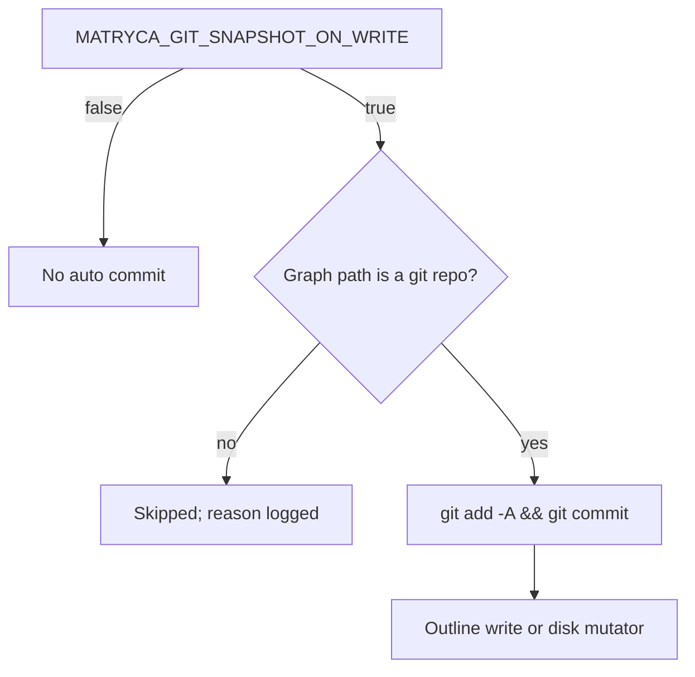
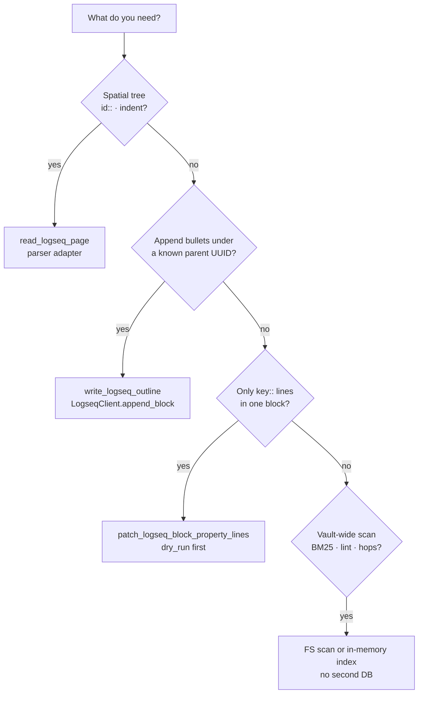
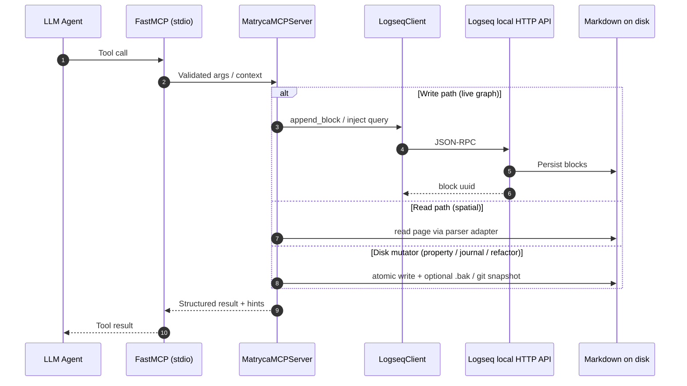
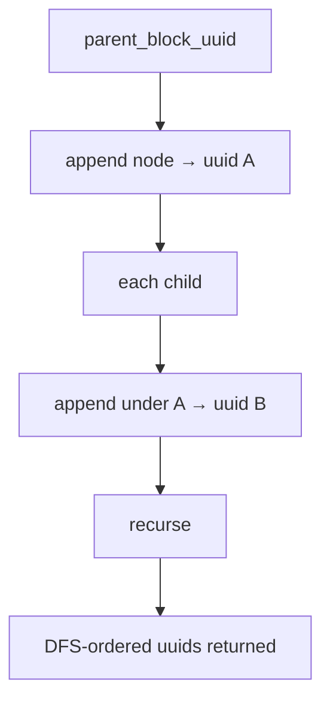
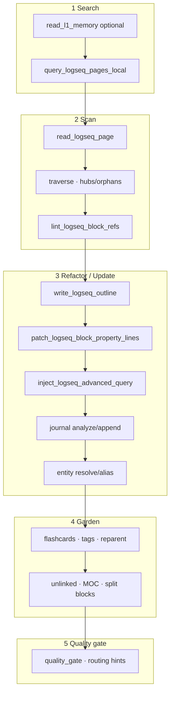
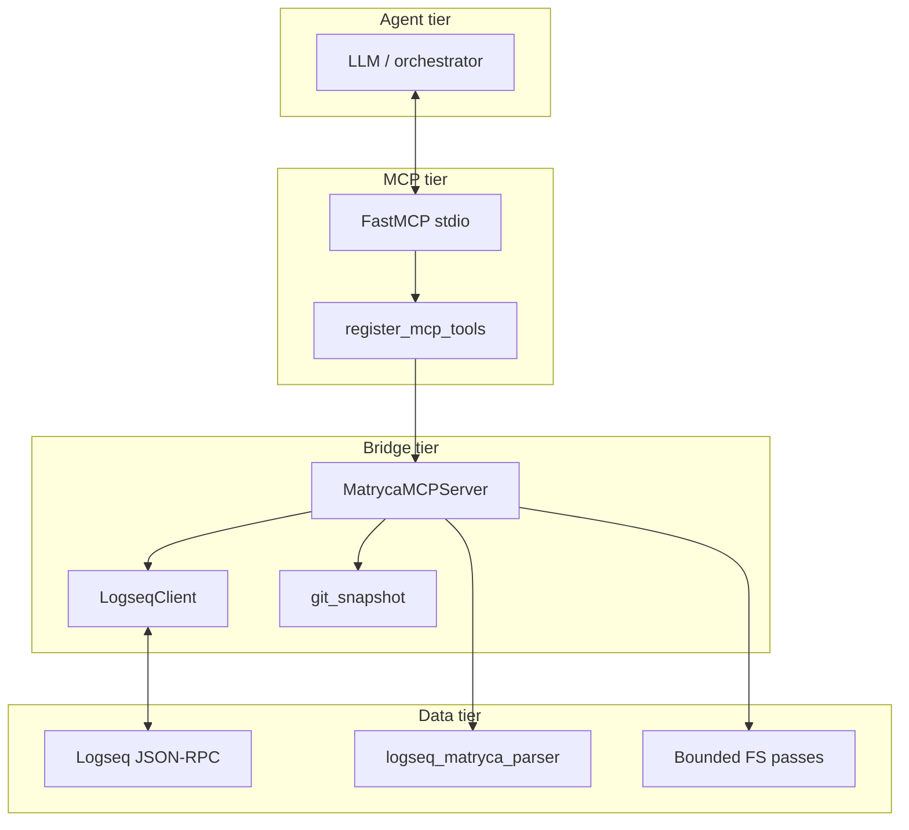

# Architecture

**matryca-logseq-llm-wiki** connects an LLM agent to **Logseq OG** (pure local Markdown) through **FastMCP**, **Pydantic**, and a thin async **Logseq HTTP JSON-RPC** client. This document is the engineering contract: *why* there is no second database, *where* spatial parsing lives, and *how* the agentic pipeline is supposed to run.

---

## Core philosophy

### No external database (defended)

The **only** durable system of record is the tree under **`LOGSEQ_GRAPH_PATH`**: `pages/`, `journals/`, `templates/`, and the rest of your Logseq graph on disk.

We deliberately **do not** add Postgres, SQLite, Redis, an embedding index, or a document store that could fork truth away from Logseq’s files.

**Why this matters:**

1. **One artifact for humans and agents** — Diffs, `git blame`, full-text search, and backup tools see exactly what Logseq sees.
2. **No sync nightmare** — A secondary DB would need invalidation rules every time a human edits a file outside the agent.
3. **Forces block-shaped thinking** — Agents are steered toward API appends and scoped file edits instead of “replace the whole page.”

When we need **ranking** (BM25), **adjacency** (wikilink/tag BFS), or **aggregates** (dashboard counts), we compute them **inside the MCP process** for that request and discard them. That is *caching*, not a competing database.

### Parser for spatial truth; bounded line work for surgery and scale

**[logseq-matryca-parser](https://github.com/MarcoPorcellato/logseq-matryca-parser)** (`logseq_matryca_parser`) owns the hard problem: **indentation**, block boundaries, and a faithful spatial view of a page. Our adapter **`src/rag/matryca_hooks.py`** feeds **`read_logseq_page`** so agents get the same block tree semantics Logseq uses — we do **not** fork a second full-file Markdown AST in this repo.

We **do** implement **narrow, auditable** passes on raw text where the parser is the wrong abstraction or we need graph-wide coverage:

| Class of work | Representative tools / modules | Mechanism |
|---------------|----------------------------------|-----------|
| **Scoped metadata** | `patch_logseq_block_property_lines` — `src/graph/property_line_edit.py` | Lines **inside** the span anchored at `id:: <uuid>`; only `key::` property lines |
| **Graph-wide ref integrity** | `lint_logseq_block_refs` — `src/graph/block_ref_lint.py` | Two-pass regex: collect all `id::` UUIDs, validate each `((uuid))` |
| **Lexical discovery** | `query_logseq_pages_local` — `src/rag/local_query.py` | Token bags + Okapi BM25 in memory |
| **Structural hops** | `traverse_logseq_structural_hops`, hub/orphan reports — `src/graph/link_tag_hop.py` | Wikilinks, `#tags` / `tags::`, light `type::` / `domain::` edges on disk |
| **Hashtag normalization** | `lint_unify_logseq_tags` — `src/graph/tag_unify.py` | Token-level `#tag` detection with guards (URLs, wikilinks, code); **not** prose “fixes” |
| **Journals & aliases** | `journal_task_scan.py`, `alias_index.py` | Line- and property-oriented scans tuned to Logseq conventions |

**Design principle:** use the **parser** when hierarchy and block identity must be correct; use **line-bounded regex and explicit file boundaries** when the operation is surgical, graph-wide, or must stay diff-friendly in code review.

### FastMCP + Pydantic at the boundary

`src/main.py` constructs **FastMCP** with a lifespan that wires **`LogseqClient`** and **`MatrycaWikiConfig`**. **`register_mcp_tools`** in **`src/agent/mcp_server.py`** attaches every tool. Incoming outline JSON is validated as **`OutlineNode`**: `page_type` / `domain` / `entity_type` rules, normalized `children`, and **fail-fast** behavior before any HTTP or disk mutation.

### Git snapshots as opt-in rollback

**`MATRYCA_GIT_SNAPSHOT_ON_WRITE`** (`src/agent/git_snapshot.py`) optionally runs **`git add -A` + `git commit`** on **`LOGSEQ_GRAPH_PATH`** when it is a git checkout — not a hosted backup product, but a **local, operator-controlled** safety rail. **`snapshot_logseq_graph_git`** exposes the same behavior for manual checkpoints.

### Choosing read vs write paths

---

## End-to-end data flow

The MCP host spawns this process on **stdio**. Tool calls flow through FastMCP into **`MatrycaMCPServer`** and graph helpers: **live** block creation uses **`LogseqClient`** → Logseq’s **local** API → disk; **spatial reads** use the parser adapter; **mutators** write files atomically where applicable (often with `.bak`).

### Outline write ordering (depth-first)

`write_logseq_outline` walks **`OutlineNode`** depth-first: each **`append_block`** returns a **real** UUID before children are created, so Logseq never receives **`UNRESOLVED_PARENT_UUID`**.

---

## The agentic pipeline

Operational detail for LLMs lives in **`SYSTEM_PROMPT.md`**. At a high level:

1. **Search** — Prefer **`query_logseq_pages_local`** with **`mode=bm25`**. Optionally **`read_l1_memory`** when mistakes would be costly before touching L2.
2. **Scan** — **`read_logseq_page`** for ground truth; **`traverse_logseq_structural_hops`** / **`report_structural_hubs_orphans`** to avoid duplicate concepts; **`lint_logseq_block_refs`** when editing many `((uuid))` refs.
3. **Refactor / update** — **`write_logseq_outline`** for nested bullets; **`patch_logseq_block_property_lines`** for property-only edits; **`inject_logseq_advanced_query`** for live Datalog blocks; journal and alias tools as needed.
4. **Garden** — Flashcards, tag unify, reparent, unlinked mentions, MOC generation, large-block split — almost always **`dry_run=true`** first.
5. **Quality gate** — No credentials in L2, sane fan-out, stable `id::`, re-lint refs after big edits (`src/agent/quality_gate.py` + prompts).

**Read-only health:** **`render_logseq_dashboard`** builds **[[Matryca Dashboard]]**-style outline stats from `pages/**/*.md`.

---

## Phase breakdown (how the codebase grew)

Use this as a **mental map** for `src/` — phases are product language; modules are what you grep.

| Phase | What shipped | Why it exists |
|:-----:|--------------|---------------|
| **1 — Baseline** | MCP server, **`OutlineNode`**, **`write_logseq_outline`** (DFS `append_block`), **`read_logseq_page`** via parser adapter, block-ref lint, dashboard markdown | Prove the bridge: agents can **read spatially** and **write block-by-block** with validation |
| **2 — L1 / L2** | **`read_l1_memory`**, routing hints in responses | Session-critical rules without scanning the whole vault |
| **3 — PKM refinements** | BM25 query, structural hops + hubs/orphans, property-line patcher, templates, wiki lint, namespace index, **git snapshot** hook | Discovery + **safe** disk edits + house-style templates |
| **4 — Logseq superpowers** | Advanced query injection, journal task scan + append, alias index + append | Native Logseq power features agents should use instead of static lists |
| **5 — Graph gardener** | Flashcards from Q/A pairs, vault-wide tag unify, same-page reparent | PKM hygiene at scale |
| **6 — Synthesis engine** | Unlinked mentions scan, MOC generator, large-block splitter, manual git snapshot tool | Graph “thickening” and long-bullet repair |

**Cross-cutting:** **`src/graph/wiki_lint.py`**, **`src/config.py`**, **`matryca-wiki.yml`**, **`docs/openspec/`**, **`PROJECT_DIARY.md`**.

---

## Component layers

---

## Key entry points

| Path | Role |
|------|------|
| `src/main.py` | FastMCP app, lifespan, `register_mcp_tools` |
| `src/agent/mcp_server.py` | All `@mcp.tool()` handlers, `OutlineNode`, `MatrycaMCPServer` |
| `src/bridge/logseq_client.py` | Async JSON-RPC over HTTP |
| `src/agent/git_snapshot.py` | Optional commits on graph root |
| `src/rag/matryca_hooks.py` | Parser adapter for spatial reads |

---

## Related reading

- **[`SYSTEM_PROMPT.md`](../SYSTEM_PROMPT.md)** — agent rules (outlines, dry-runs, L1/L2)  
- **[`ROADMAP_LLM_WIKI.md`](../ROADMAP_LLM_WIKI.md)** and phase roadmaps — checklist history  
- **[`docs/openspec/README.md`](openspec/README.md)** — trimmed internal specs  
