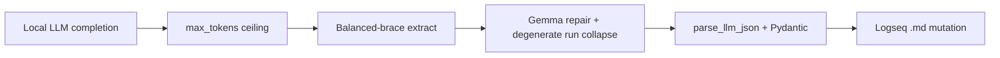

# Resilient structured output — TRIZ applied to local LLMs

**Status:** Shipped (see [`CHANGELOG.md`](../CHANGELOG.md) under `[Unreleased]` / recent releases).  
**Modules:** [`json_repair.py`](../src/utils/json_repair.py), [`llm_client.py`](../src/agent/llm_client.py), [`plumber_config.py`](../src/agent/plumber_config.py)  
**Related:** [`openspec/llm-performance.md`](openspec/llm-performance.md), [`v1.8-SOFTWARE-EDGE-PLAN.md`](v1.8-SOFTWARE-EDGE-PLAN.md)

Matryca Plumber does **not** treat the local LLM as an oracle. It treats inference as an **unreliable edge sensor** and applies **Resilience Engineering** plus **TRIZ** so graph mutations stay safe on CPU-only hosts (16 GB RAM, models under ~10B parameters such as **Gemma 4-E4b Instruct**).

This document explains the **“Gemma tail of death”** class of failures and how we turned a classic local-LLM foot-gun into a **structural, test-backed contract** — not a one-off patch.

---

## Why this matters for v1.8 edge computing

| Risk without guards | v1.8 constraint violated |
|---------------------|---------------------------|
| Runaway completion tokens | Thermal / CPU budget; host becomes unresponsive |
| Greedy JSON extraction ingests garbage | Wrong or failed semantic index writes |
| Blind trust in model stop (`<eos>`) | Daemon blocks; fan spin; RAM pressure on LM Studio / llama.cpp |

**Product stance:** Graph quality and **host survival** rank above shaving a few milliseconds off regex parsing. The daemon must **govern** the model, not wrap it.

---

## 1. The “Gemma tail of death” (symptom → mechanism)

### What operators see

During semantic indexing (e.g. a large person page), LM Studio logs show:

- A plausible `SemanticIndexResult` JSON (`summary`, `suggested_tags`, `semantic_corrections`, …).
- Then a long stream of **literal** `\` + `n` pairs (not real newlines).
- Token counters keep climbing; CPU and RAM spike; **nothing useful** lands in the Logseq graph.

### Mechanism (not a Matryca parser bug)

Small instruct models, when forced into **strict JSON**, sometimes **fail to emit an end-of-sequence stop**. Instead of halting, the model enters a **degenerate repetition loop** — repeating the last high-probability pattern in context (here, escaped newline tokens from JSON formatting).

Without an upper bound on generation length, that loop can consume **the entire completion budget** of the inference server, starving the OS and breaking v1.8’s edge-computing guarantees.

**TRIZ contradiction:** We need *rich* structured output for dense pages, but we must *forbid* unbounded generation.

**Resolution:** Separate **useful payload** from **degenerate tail** in space; cap generation in time/tokens **before** parsing (see §2–4).

---

## 2. TRIZ mapping — from contradiction to design

| Ideal Final Result (IFR) | “The daemon receives only one valid JSON object; zero tokens after the closing `}` matter.” |
|--------------------------|------------------------------------------------------------------------------------------------|
| **Separation in space** | Extract the first **brace-balanced** object; discard everything after the matching `}`. |
| **Prior action (#10)** | Set `max_tokens` on every structured completion so the server kills runaway loops. |
| **Self-service (#25)** | Repair Gemma-specific key leakage and collapse 16+ literal `\n` runs before `json.loads`. |
| **Nested doll (#7)** | Path A (strict schema) → Path B (Instructor + repair) → page `status=error` (no silent graph corruption). |



### Anti-pattern we removed: greedy `{.*}` + DOTALL

A regex like `(\{.*\})` with `DOTALL` tells the engine: *“Match from the first `{` to the last `}` in the entire completion.”* If the model appended kilobytes of `\n` noise **before** a spurious trailing `}`, the extractor swallowed it all — slow, fragile, and wrong.

**Balanced-brace extraction** counts `{` / `}` outside JSON strings and **stops at the first well-formed root object**. Everything after that closing brace is **out of scope** for the graph pipeline. This is **O(n)**, deterministic, and independent of model politeness.

Implementation: `extract_json_object()` / `extract_json_payload_regex()` in [`json_repair.py`](../src/utils/json_repair.py).

---

## 3. Layered defenses (defense in depth)

| Layer | Control | Env / API | Purpose |
|-------|---------|-----------|---------|
| **1. Generation brake** | `max_tokens` on Path A, Path B, and raw JSON salvage | `MATRYCA_LLM_MAX_COMPLETION_TOKENS` (default **2048**, clamp 256–8192) | Server-side stop even if the model never emits `<eos>` |
| **2. Spatial trim** | `sanitize_llm_completion_text()` before validation | — | Drop post-JSON tail; log trim size when significant |
| **3. Gemma grammar repair** | `fix_gemma_leaked_literal_newline_before_keys()` | — | Normalize `\n  \"key` leakage into valid `"key` openings |
| **4. Degenerate run collapse** | `collapse_degenerate_literal_backslash_n_runs()` (+ `\t`, `\"` runs) | — | Remove 16+/32+ literal escape loops |
| **5. Legacy repair** | `fix_double_escaped_quote_runs()`, trailing garbage strip, bracket balance | — | Existing Gemma quote-leak fixes (v1.7+) |
| **6. Schema gate** | Pydantic `SemanticIndexResult` + safe correction rules | — | No destructive graph writes from malformed proposals |
| **7. Array roots** | `extract_json_array()` balanced `[` `]` | — | Same tail-trim contract for rare array-shaped payloads |
| **8. Prose / compression** | `sanitize_prose_llm_completion()` + `MATRYCA_LLM_MAX_COMPRESSION_TOKENS` | `MATRYCA_LLM_PROSE_COMPLETION_MAX_CHARS` | Stops newline walls in Ermes history condensation |
| **9. History hygiene** | `sanitize_llm_history_turn()` on `_append_execution_turn` | — | Prevents one bad turn from poisoning the next page |

**Analogy:** `max_tokens` is the **brake**; balanced extraction is the **scalpel**; sanitization is the **filter** on the operating table. Together they protect the host **and** the vault.

---

## 4. Integration with adaptive structured output

This resilience stack sits **under** the existing probe-driven paths documented in [`openspec/llm-performance.md`](openspec/llm-performance.md):

| Path | Resilience hooks |
|------|------------------|
| **A** — strict `json_schema` | `max_tokens` + `sanitize_llm_completion_text` + `parse_llm_json` |
| **B** — Instructor / MD_JSON | Same cap; salvage path uses full `repair_llm_json` pipeline |
| **Exhausted** | `StructuredOutputExhaustedError` — page skipped until mtime changes |

Foreground daemon: `probe_backend()` once at start; per-page `index_page` uses `stateless=True` so Ermes history does not amplify bad completions.

---

## 5. Related failure modes (TRIZ audit)

| Symptom | Subsystem | TRIZ resolution |
|---------|-----------|-----------------|
| JSON tail after indexing | `json_repair` + Path A/B | Separation in space (balanced `{` `}`) + brake (`max_tokens`) |
| Newline wall in **compression** markdown | `_compress_history_via_llm` | Prior action: `MATRYCA_LLM_MAX_COMPRESSION_TOKENS`; prose sanitizer |
| Degenerate turn **amplified** on next page | `_append_execution_turn` | History hygiene before Ermes stores assistant JSON/markdown |
| Greedy ingest of array JSON + tail | `extract_json_array` | Same balanced scanner as objects; greedy `.*` regex removed |
| `\t` / `\"` repetition loops | `collapse_degenerate_literal_*` | Parameter change: treat other escape tokens like `\n` |
| **Truncated JSON** (no closing `}`) | `_recover_unbalanced_json_slice()` | When `max_tokens` cuts mid-object, salvage prefix + last `}` |
| **MCP agent JSON** | `parse_json_object` → `loads_repaired_json` | Same repair for Cursor/Claude tool payloads |
| **Path B retry pollution** | `append_correction_turn` collapses error tail | Self-correction prompts stay bounded |
| **Huge cluster context** | `MATRYCA_CLUSTER_FOCUS_MAX_CHARS` | Louvain clusters cannot blow the stable prefix |

**Contradiction removed:** “We need long Ermes memory” vs “one hallucination must not dominate the context window.” **Separation in time:** compress with a cap; **self-service:** sanitize before append.

---

## 6. Observability (optional debug instrumentation)

For exotic local models (Qwen, Phi, future GGUF builds), set `MATRYCA_LLM_DEBUG_JSON=true`. [`agent_debug_log.py`](../src/utils/agent_debug_log.py) then appends NDJSON to `MATRYCA_LLM_DEBUG_LOG_PATH` (default `.cursor/debug-llm.jsonl`):

- `grammar_capability`, attempt count (Path B)
- `raw_len`, `max_literal_backslash_n_run`, `completion_tokens`
- `index_page` success / failure

Off by default. Production visibility remains `logs/matryca_plumber_ops.log` and token JSONL.

---

## 7. Verification

| Scenario | Test |
|----------|------|
| Valid JSON + 400× literal `\n` tail | `tests/test_json_repair.py::test_repair_strips_degenerate_literal_backslash_n_tail` |
| Gemma key newline leakage | `test_fix_gemma_leaked_literal_newline_before_keys` |
| Sanitize + `SemanticIndexResult` | `test_sanitize_llm_completion_text_trims_tail_and_parses_index` |
| Path B salvage | `tests/test_maintenance_daemon.py::test_completion_with_structured_output_uses_lenient_json_repair` |
| JSON array + `\n` tail | `test_extract_json_array_ignores_degenerate_tail` |
| Prose newline loop | `test_sanitize_prose_collapses_newline_loop` |
| Compression `max_tokens` | `tests/test_llm_client_adaptive.py::test_compress_history_uses_max_tokens` |

**Targeted pytest (subset — disable coverage gate):**

```bash
uv run pytest tests/test_json_repair.py tests/test_llm_client_adaptive.py -q --no-cov
# or: make test-resilience
```

Full suite (CI coverage ≥ 70%): `uv run pytest -q` or `make test`.

**Manual soak (recommended after model or quant change):**

1. Index a large, block-rich page (many `id::` lines).
2. Confirm LM Studio stops near the token cap without a `\n` wall.
3. Confirm Logseq shows a semantic index block (summary / tags) and CPU returns to idle.

---

## 8. Why TRIZ here is innovative (not buzzwords)

Most “LLM wrappers” bolt on `json.loads` and hope. Matryca Plumber uses TRIZ **before coding**:

1. State the **contradiction** (rich output vs bounded edge resources).
2. Define the **IFR** (only the JSON object matters).
3. Choose **separation, prior action, and self-service** as separate mechanisms — each testable in isolation.
4. **Never** trust a single layer (regex-only, or cap-only, or repair-only).

That process produced a **resilience specification** that ships in `json_repair.py` and `llm_client.py` and is referenced across architecture docs — so the next contributor extends the **system**, not a comment in a PR.

**Enterprise distinction:** A wrapper asks the model to behave. **Infrastructure governs** the model, documents failure modes, and keeps the Logseq graph pristine when it does not.

---

## Operator reference

```bash
# Default — sufficient for Gemma 4-E4b on 16 GB CPU
MATRYCA_LLM_MAX_COMPLETION_TOKENS=2048
MATRYCA_LLM_MAX_COMPRESSION_TOKENS=1536

# Very large semantic_corrections catalogs (rare)
# MATRYCA_LLM_MAX_COMPLETION_TOKENS=4096

# Optional NDJSON trace (off by default)
# MATRYCA_LLM_DEBUG_JSON=true
```

See also the **v1.8 Edge computing** block in [`.env.example`](../.env.example).
